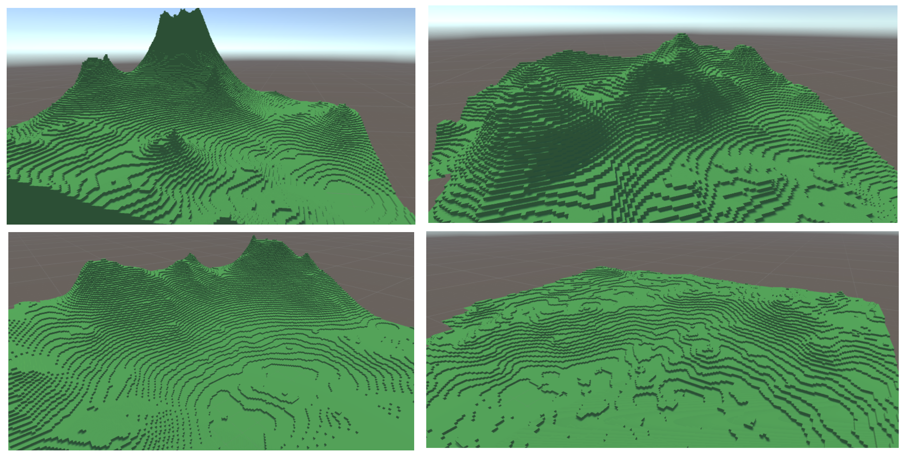

# Small procedural terrain gennerator

## Overview

This project is an idea based on CPC (compound poisson cascades) that are multiplicative fractals. They are commonly used to generate "natural images", that share some statistical properties with natural images.

I used images generated with this idea to define heightmaps for procedural terrain generation.

## Theory

CPC and so on.

## Good points and bad points

Bad ones : 
 - computationally more expensive than the usual methods with noise
 - a bit technical to understand : need an internal knowledge to understand how to create nice terrains
 - hard to do sharp structures like cliffs, as long as the image is blurred to get best results
 - is heavier to store than usual methods

Good ones : 
 - no continuity problems, as we can extend infinitely the generated images
 - get good results
 - can imply structures depending on the kernel used

## To improve

I coded the CPC in python and I use the generated images in the unity project. It would be nicer to code the CPC in unity or bind python with unity.
